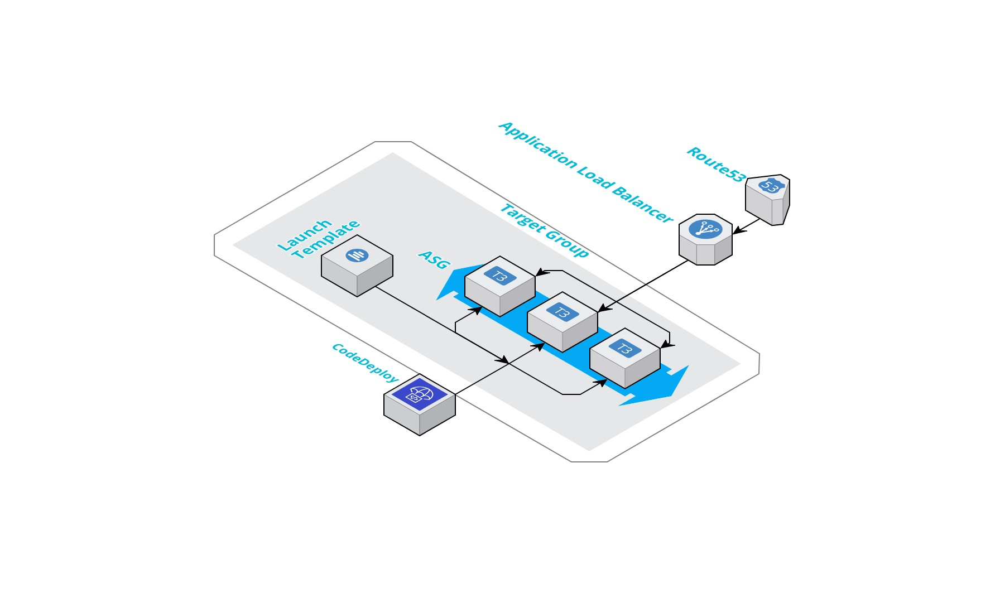

# aws-cdk-microservice
aws-cdk-microservice construct library is an open-source extension of the AWS Cloud Development Kit (AWS CDK) to deploy configurable microservice infra and its individual components in less than 50 lines of code and human readable configuration which can be managed by pull requests!

## A typical microservice architecture on AWS looks like:


 Using cdk a microservice can be deployed using the following sample code snippet:
 ```typescript
import { Stack, StackProps } from '@aws-cdk/core';
import { Construct } from 'constructs';
import { InfraEnv, MicroService, ProductName } from '@smallcase/aws-cdk-microservice';
import { App } from '@aws-cdk/core';

export class UnknownAPIStackDev extends Stack {
  constructor(scope: Construct, id: string, props?: StackProps) {
    super(scope, id, props);
    new MicroService(stack, 'UnknownAPI', {
      appName: 'UnknownAPI',
      env: 'development',
      asgMaxSize: '1',
      asgMinSize: '1',
      diskSize: 20,
      instanceLabels: [
        {
          key: 'NODE-VERSION',
          propagateAtLaunch: true,
          value: '12',
        },
        {
          key: 'TYPE',
          propagateAtLaunch: true,
          value: 'application',
        },
      ],
      instanceType: 't3.micro',
      vpc: 'vpc-1234567',
      port: 8000,
      protocol: 'HTTP',
      healthCheckPath: '/health',
      subnets: ['subnet-987654321', 'subnet-12345678'],
      tcpRules: [
        {
          sourceSG: 'sg-12345678',
          description: 'ssh rule',
          port: 22,
        },
      ],
      host: 'abc-test-123.smallcase.com',
      lbArn: 'arn:aws:elasticloadbalancing:ap-south-1:12345678910:loadbalancer/app/API-DEV-External',
      sslEnabled: false,
      sshKey: 'master-dev',
      createCodedeployApplication: true,
      role: {
        type: 'new',
      },
    });
  }
}

new UnknownAPIStackDev(app, 'UnknownAPIStackDev', {
  env: { account: '12345678910', region: 'ap-south-1' },
});

app.synth()
```
Please refer [here](/API.md) to check how to use individual resource constructs.

Install using NPM:
```
npm install @smallcase/aws-cdk-microservice
```
Using yarn
```
yarn add @smallcase/aws-cdk-microservice
```

Configuration helper
| **Property**                 | **Type**                                  | **Default** | **Description**                                                                                                                                                                                                                                                 |
|------------------------------|-------------------------------------------|-------------|-----------------------------------------------------------------------------------------------------------------------------------------------------------------------------------------------------------------------------------------------------------------|
| appName                      | string                                    |             | Name of the application to be deployed                                                                                                                                                                                                                          |
| applicationType?              | string                                    | new         | Type of application, new or existing, if existing, codedeploy will skip it's application creation and create a deployment group in existing application.                                                                                                        |
| asgMaxSize?                  | number                                    | 2           | Max ASG scale size                                                                                                                                                                                                                                              |
| asgMinSize?                  | number                                    | 1           | Min ASG scale size                                                                                                                                                                                                                                              |
| env?                         | string                                    | development | Application environment name                                                                                                                                                                                                                                    |
| instanceLabels?              | CfnAutoScalingGroup.TagPropertyProperty[] | []          | Tags to apply to the stack                                                                                                                                                                                                                                      |
| healthCheckPath?             | string                                    | /health     | Health check path for target group                                                                                                                                                                                                                              |
| port?                        | number                                    | undefined   | Port on which application is running. If not passed, target group will not be created                                                                                                                                                                           |
| protocol?                    | string (HTTP/HTTPS/GRPC)                  | HTTP        | Service protocol                                                                                                                                                                                                                                                |
| diskSize?                    | number                                    | 8GB         | Size of root volume for launch template                                                                                                                                                                                                                         |
| vpc                          | string                                    |             | VPC in which application infra is to be deployed                                                                                                                                                                                                                |
| role?                        | string                                    |             | Role ARN which is to be used with launch template                                                                                                                                                                                                               |
| tcpRules                     | IngressRule[]                             | []          | TCP Rules which are to be applied to the security group                                                                                                                                                                                                         |
| subnets                      | string[]                                  |             | Subnets in which subnets are to be deployed                                                                                                                                                                                                                     |
| sslEnabled?                  | boolean                                   | false       | Whether to use HTTPS ALB listener, or HTTP ALB listener                                                                                                                                                                                                         |
| host?                        | string                                    |             | DNS name, for example abc.xyz.com. Won't be created if TG is not created,                                                                                                                                                                                       |
| lbArn?                       | string                                    |             | Load balancer arn for application load balancing                                                                                                                                                                                                                |
| sshKey                       | string                                    |             | The ssh key pair name which is to be used                                                                                                                                                                                                                       |
| diskType?                    | string (GP2/GP3/IO1/IO2)                  | GP3         | Type of disk to be used                                                                                                                                                                                                                                         |
| createCodedeployApplication? | boolean                                   | false       | Whether to create a codedeploy application and a deployment group for current ENV passed, if applicationType is new, this will not create an application but will create a new deployment group in the same application name, will throw an error if not found. |
| deploymentPolicies?          | string[]                                  | []          | Deployment group policies which are to be passed, there are major policies already attached which will allow usage of S3 and triggering codedeploy agents on instances.                                                                                         |


Bootstrap the environment
```
cdk bootstrap
```

Check the changed which are to be deployed
```
~ -> cdk diff
Stack my-stack-dev
...
IAM Policy Changes
┌───┬──────────────────────────────────────────────────────────────────────────────┬────────────────────────────────────────────────────────────────────┐
│   │ Resource                                                                     │ Managed Policy ARN                                                 │
├───┼──────────────────────────────────────────────────────────────────────────────┼────────────────────────────────────────────────────────────────────┤
│ + │ ${UnknownAPI/development-UnknownAPI-as/development-UnknownAPI-ASG-stackRole} │ arn:aws:iam::aws:policy/service-role/AmazonEC2SpotFleetTaggingRole │
│ + │ ${UnknownAPI/development-UnknownAPI-as/development-UnknownAPI-ASG-stackRole} │ arn:aws:iam::aws:policy/ReadOnlyAccess                             │
│ + │ ${UnknownAPI/development-UnknownAPI-as/development-UnknownAPI-ASG-stackRole} │ arn:aws:iam::aws:policy/service-role/AmazonEC2RoleforSSM           │
│ + │ ${UnknownAPI/development-UnknownAPI-as/development-UnknownAPI-ASG-stackRole} │ arn:aws:iam::aws:policy/AmazonEC2FullAccess                        │
└───┴──────────────────────────────────────────────────────────────────────────────┴────────────────────────────────────────────────────────────────────┘
Security Group Changes
┌───┬─────────────────────────────────────────────────────────────────────────────────────┬─────┬────────────┬─────────────────┐
│   │ Group                                                                               │ Dir │ Protocol   │ Peer            │
├───┼─────────────────────────────────────────────────────────────────────────────────────┼─────┼────────────┼─────────────────┤
│ + │ ${UnknownAPI/development-UnknownAPI-as/development-UnknownAPI-ASG-stack-sg.GroupId} │ In  │ TCP 22     │ sg-12346578     │
│ + │ ${UnknownAPI/development-UnknownAPI-as/development-UnknownAPI-ASG-stack-sg.GroupId} │ Out │ Everything │ Everyone (IPv4) │
└───┴─────────────────────────────────────────────────────────────────────────────────────┴─────┴────────────┴─────────────────┘
(NOTE: There may be security-related changes not in this list. See https://github.com/aws/aws-cdk/issues/1299)

Resources
[+] AWS::EC2::SecurityGroup UnknownAPI/development-UnknownAPI-as/development-UnknownAPI-ASG-stack-sg UnknownAPIdevelopmentUnknownAPIasdevelopmentUnknownAPIASGstacksg858F9DBC 
[+] AWS::EC2::SecurityGroupIngress UnknownAPI/development-UnknownAPI-as/development-UnknownAPI-ASG-stack-sg/from mystackdevUnknownAPIdevelopmentUnknownAPIassgf9c56492221D098D02:22 UnknownAPIdevelopmentUnknownAPIasdevelopmentUnknownAPIASGstacksgfrommystackdevUnknownAPIdevelopmentUnknownAPIassgf9c56492221D098D0222498F0E3E 
[+] AWS::IAM::Role UnknownAPI/development-UnknownAPI-as/development-UnknownAPI-ASG-stackRole UnknownAPIdevelopmentUnknownAPIasdevelopmentUnknownAPIASGstackRole3CEFE0B7 
[+] AWS::IAM::Policy UnknownAPI/development-UnknownAPI-as/development-UnknownAPI-ASG-stackRole/DefaultPolicy UnknownAPIdevelopmentUnknownAPIasdevelopmentUnknownAPIASGstackRoleDefaultPolicy8F61E954 
[+] AWS::IAM::InstanceProfile UnknownAPI/development-UnknownAPI-as/development-UnknownAPI-LT/Profile UnknownAPIdevelopmentUnknownAPIasdevelopmentUnknownAPILTProfileC84DF85A 
[+] AWS::EC2::LaunchTemplate UnknownAPI/development-UnknownAPI-as/development-UnknownAPI-LT UnknownAPIdevelopmentUnknownAPIasdevelopmentUnknownAPILT3B54AB26 
[+] AWS::ElasticLoadBalancingV2::TargetGroup UnknownAPI/development-UnknownAPI-as/development-UnknownAPI-TG UnknownAPIdevelopmentUnknownAPIasdevelopmentUnknownAPITG141FD907 
[+] AWS::AutoScaling::AutoScalingGroup UnknownAPI/development-UnknownAPI-as/development-UnknownAPI-ASG UnknownAPIdevelopmentUnknownAPIasdevelopmentUnknownAPIASGEC1B4F9C 
[+] AWS::IAM::Role UnknownAPI/UnknownAPI-deployment-group-role UnknownAPIUnknownAPIdeploymentgrouprole6E048442 
[+] AWS::IAM::Policy UnknownAPI/UnknownAPI-deployment-group-role/DefaultPolicy UnknownAPIUnknownAPIdeploymentgrouproleDefaultPolicy176FEC37 
[+] AWS::CodeDeploy::Application UnknownAPI/development-UnknownAPI-cd/UnknownAPI-development UnknownAPIdevelopmentUnknownAPIcdUnknownAPIdevelopment72A04EEC 
[+] AWS::CodeDeploy::DeploymentGroup UnknownAPI/development-UnknownAPI-cd/development UnknownAPIdevelopmentUnknownAPIcddevelopmentC502CFAD 
```
this is a trimmed output.


Deploy using
```
~ -> cdk deploy
```

PS: Because of an [aws-cdk issue](https://github.com/aws/aws-cdk/issues/6803), creating a Route 53 record from existing load balancer is not possible using cdk.